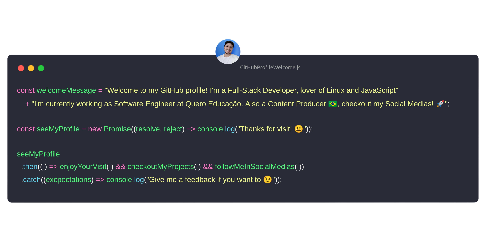

# Nicolas Lima
   

-----

### Hello World :sunglasses::fist:

### Articles :book:
* [*How functional programming made me an better developer, with Elixir*](https://dev.to/nicolaslima321/how-functional-programming-made-me-an-better-developer-with-elixir-34eg) **(Checkout my first article :D)**

### About me :bookmark:

  
    
    
  

***

#### Technologies
  * #### **Back-End and Frameworks** :computer:
    
    
    
    
    
    
    
    
    
    
    
    

  * #### **Front-End and Frameworks** :sparkles:
    
    
    
    
    
    

    *Electron is for desktop btw*
    
  * #### **Mobile** :iphone:
    
    

  * #### **DevOps** :penguin:
    
    
    
    
    
    

  * #### Embedded Systems (Just for fun) :robot:
    
    

***

#### Hobbies
* 🎸 I'm ***Bassist*** **(SLAP!)** also play Acoustic and Eletric Guitar.. In general, a music lover!
